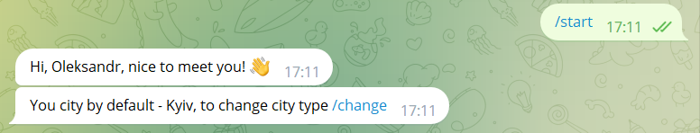
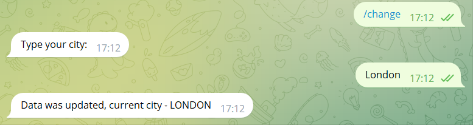
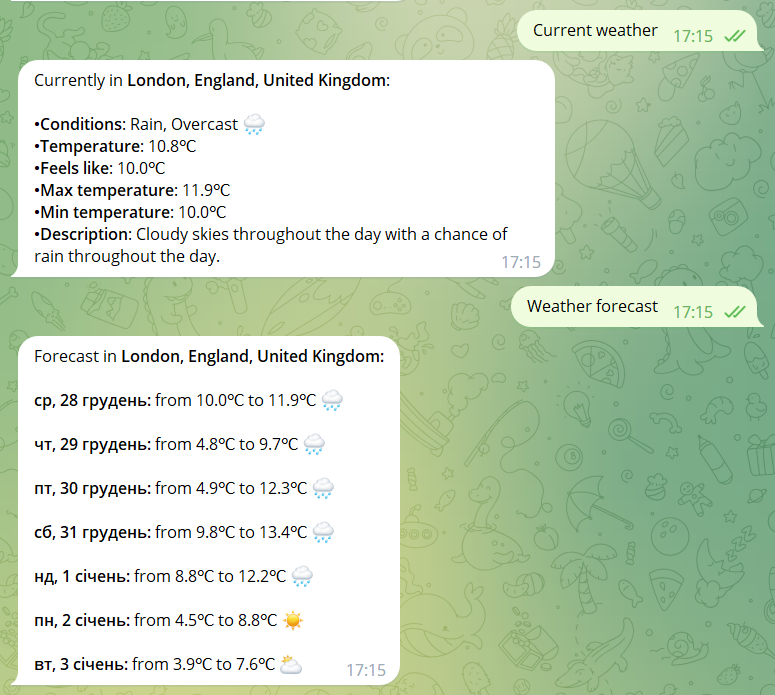

# telegram-weather-bot

### Project description:
 This is a simple telegram bot whose main task is to get 
 the latest weather forecast. The application is built on 
 Spring Boot using spring data, hibernate, relational 
 database and additional APIs.

 The bot can show a detailed weather forecast for today 
 and for the next 7 days. The bot allows you to change 
 the current city and remember it.

### Application was built with:
* Java 11
* Spring Boot
* Spring Data
* Hibernate
* MySQL
* Telegram Bot API
* Weather API (visualcrossing)

### How to launch project:
> First of all, you need to create your own bot. 
> * open Telegram 
> * find @BotFather in the search bar
> * run and create 
> your own bot with the /newbot command
> * receive own bot token

1. Clone this project.
2. Create new schema in MySQL.
3. In the resource folder open application.properties file
and add your bot data and db configuration.
4. Check pom.xml. If there are errors - fix them.
5. Run application.

### Examples of bot work:

